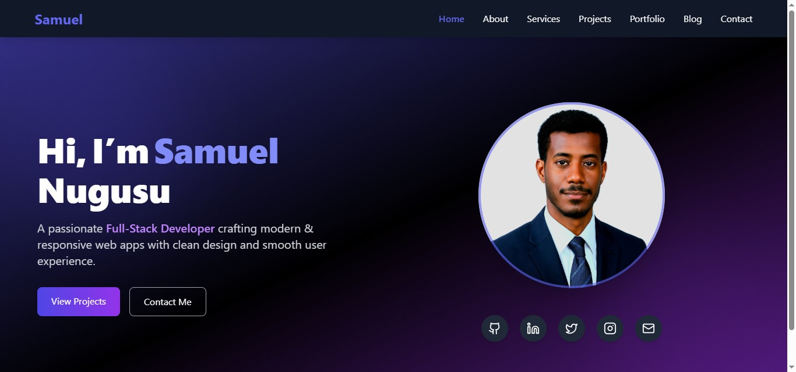

# 🌐 Personal Portfolio Website

A modern, responsive, and animated portfolio website built with **React, TailwindCSS, and Framer Motion** to showcase my skills, projects, and professional journey.

 <!-- Optional: add a screenshot of your site -->

---

## 🚀 Features

- ⚡ **Fast & Responsive** – Works seamlessly across all devices.  
- 🎨 **Modern UI/UX** – Subtle gradients, glass effects, and soft shadows for a clean look.  
- 🧩 **Modular Components** – Reusable, scalable structure.  
- 📂 **Projects Showcase** – Highlights my best work.  
- ✍️ **Blog Section** – Sharing ideas, insights, and learning.  
- 💬 **Testimonials / Reviews** – Real client feedback with animations.  
- 📞 **Contact Page** – Map + contact details + form (name, email, subject, message).  

---

## 🛠️ Tech Stack

- **Frontend:** React.js, TailwindCSS, Framer Motion  
- **Routing:** React Router DOM  
- **Hosting:** Vercel / Netlify  
- **Version Control:** Git & GitHub  

---

## ⚙️ Run Locally

```bash
# Install dependencies
npm install

# Start development server
npm run dev
